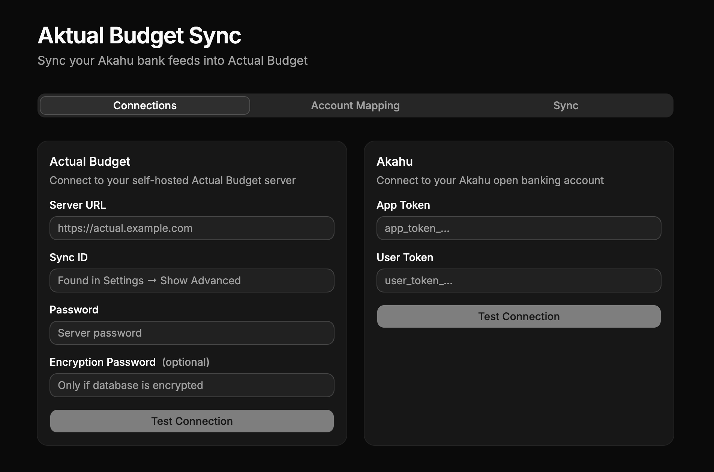

# Aktual Budget Sync

Automatically sync your New Zealand bank transactions into [Actual Budget](https://actualbudget.org) via [Akahu](https://www.akahu.nz) — the open banking API for NZ.

If you self-host Actual Budget and bank in New Zealand, this app bridges the gap. Akahu connects to your NZ banks (ASB, ANZ, BNZ, Kiwibank, etc.) and exposes your transactions through an API. This app pulls those transactions and imports them into your Actual Budget accounts on a schedule, so you don't have to manually enter or upload anything.



## Features

- **Connect** to your Actual Budget server and Akahu account with a simple UI
- **Map accounts** — link each Actual Budget account to its Akahu counterpart via dropdown selectors
- **Sync transactions** — pull transactions from Akahu and import them into Actual Budget with a single click
- **Scheduled sync** — set it to auto-sync every 1, 6, or 12 hours, or daily
- **Deduplication** — uses Akahu's transaction ID as Actual's `imported_id` so transactions are never double-imported
- **Per-account sync history** — see how many transactions were imported/updated per account per sync

## Prerequisites

- A self-hosted [Actual Budget](https://actualbudget.org) server
- An [Akahu](https://www.akahu.nz) personal app with API tokens ([developer docs](https://developers.akahu.nz))

## Quick Start (Docker)

```bash
docker run -d \
  -p 3001:3001 \
  -v ./data:/app/data \
  ghcr.io/joelbrenstrum/aktualbudget:latest
```

Then open **http://localhost:3001**.

Or with Docker Compose:

```bash
git clone https://github.com/JoelBrenstrum/aktualbudget.git
cd aktualbudget
docker compose up -d
```

## Development

```bash
npm install
npm run dev
```

This starts the Vite frontend on `:5173` and the Express backend on `:3001` concurrently.

## Scripts

| Command | Description |
|---------|-------------|
| `npm run dev` | Start frontend + backend in dev mode |
| `npm run build` | Build frontend for production |
| `npm run docker` | Build and start Docker container |
| `npm run docker:stop` | Stop Docker container |

## How It Works

1. **Connections** — Enter your Actual Budget server URL, sync ID, and password. Enter your Akahu app and user tokens. Test both connections.
2. **Account Mapping** — Select which Actual Budget account maps to which Akahu account.
3. **Sync** — Click "Sync Now" or enable a schedule. The app fetches transactions from Akahu, converts amounts to cents, and imports them into Actual Budget using `imported_id` for deduplication.

## Tech Stack

- **Frontend**: React, TypeScript, Vite, shadcn/ui, Tailwind CSS v4
- **Backend**: Express, TypeScript, tsx
- **Sync**: @actual-app/api, Akahu REST API, node-cron

## License

MIT
